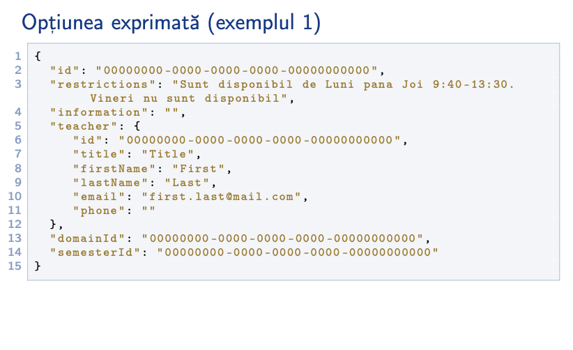
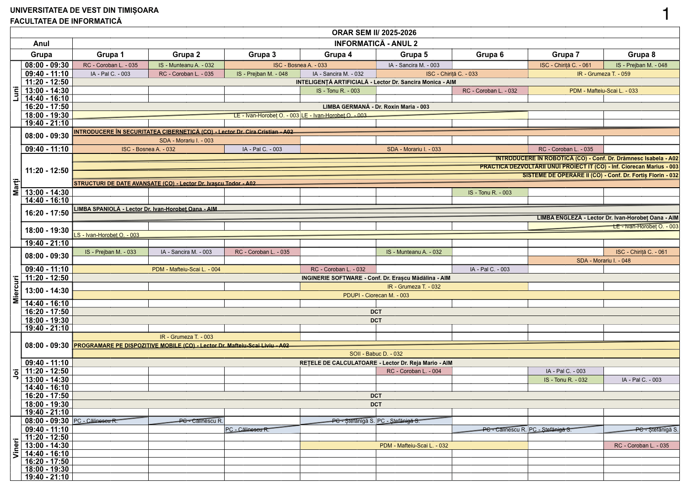
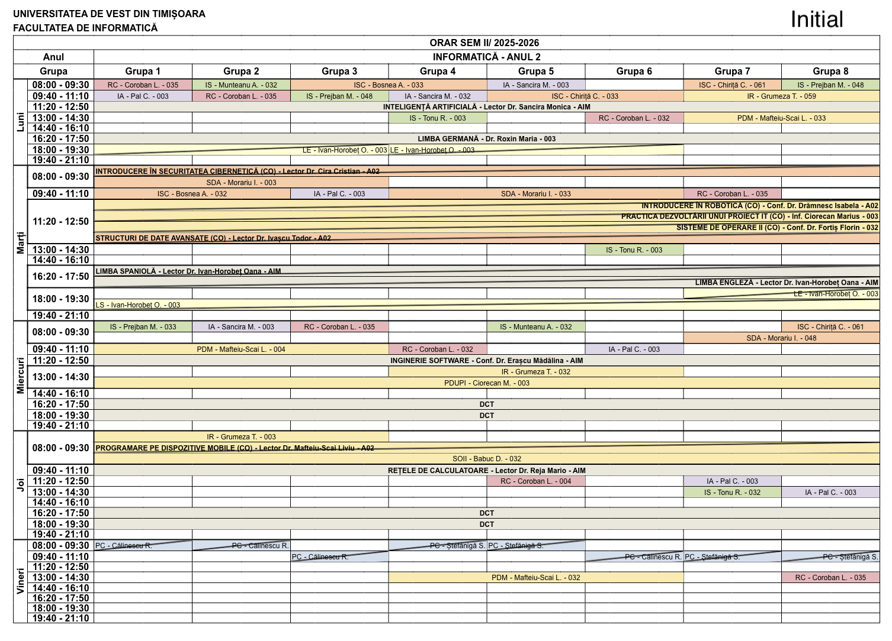

# Generarea orarelor universitare folosind un algoritm genetic și căutare adaptivă în vecinătăți extinse

Acest repository conține codul sursă aferent aplicației dezvoltate pentru generarea orarelor universitare și exemple ilustrative ale modului de funcționare. Soluția propusă extinde o platformă existentă de administrare a orarelor prin integrarea a două componente principale:

- un modul bazat pe modele lingvistice mari (LLM), utilizat pentru procesarea opțiunilor cadrelor didactice formulate în limbaj natural;
- un modul de generare automată a orarelor universitare, bazat pe o abordare hibridă care combină un algoritm genetic cu Large Neighborhood Search.

## Conținutul directorului

Directorul conține codul sursă al componentelor dezvoltate în cadrul lucrării. Acesta este organizat în trei directoare principale:

```text
is-dizertatie
├── ai-service/
|   ├── src/
|   │   ├── main/
|   │   │   ├── java/
|   │   │   │   └── uvt/orar/
|   │   │   │       ├── clients/
|   │   │   │       ├── config/
|   │   │   │       ├── controller/
|   │   │   │       ├── dto/
|   │   │   │       ├── external_services/
|   │   │   │       ├── model/
|   │   │   │       ├── ollama/
|   │   │   │       ├── repository/
|   │   │   │       └── service/
|   │   │   └── resources/
|   │   │       ├── application.yml
|   │   │       └── schema.sql
|   │   └── test/
|   ├── pom.xml
|   └── .env.example
|
├── demo/
│   ├── distrugere-reparare.gif
│   ├── evolutia-solutiei-ga-lns.gif
│   └── maparea-optiunilor.gif
|
└── generator-service/
    ├── app/
    │   ├── routers/
    │   ├── models/
    │   ├── entities/
    │   ├── services/
    │   ├── external_services/
    │   ├── mappers/
    │   ├── utils/
    │   ├── db.py
    │   └── main.py
    ├── algorithm/
    │   ├── algorithm_classes/
    │   ├── algorithm_helpers/
    │   ├── algorithm_score/
    │   ├── genetic_algorithm/
    │   ├── hard_constraints/
    │   ├── large_neighbourhood_search/
    │   ├── matrix_classes/
    │   ├── simulated_annealing/
    │   ├── soft_constraints/
    │   └── timetable_algorithm.py
    ├── alembic/
    ├── config/
    ├── constants/
    ├── helpers/
    ├── printers/
    ├── results/
    ├── requirements.txt
    ├── alembic.ini
    └── .env.example
```

- `ai-service/` – conține serviciul bazat pe modele lingvistice mari, utilizat pentru procesarea opțiunilor cadrelor didactice formulate în limbaj natural și transformarea acestora în constrângeri structurate;

- `generator-service/` – conține serviciul responsabil de generarea automată a orarelor universitare, folosind abordarea hibridă bazată pe algoritm genetic și Large Neighborhood Search;

- `demo/` – conține exemple ilustrative ale modului de funcționare a celor două module.


## Demo

### Maparea opțiunilor cadrelor didactice

În această demonstrație, două opțiuni formulate în limbaj natural sunt transformate în reprezentări structurate și mapate pe intervalele orare utilizate de platformă.



### Evoluția soluției: GA → LNS

Pornind de la soluția inițială generată de algoritmul genetic, exemplul evidențiază îmbunătățirile succesive obținute în etapa mecanismului Large Neighborhood Search.




### Ciclu distrugere–reparare în LNS

Acest exemplu prezintă un pas al mecanismului LNS, în care o parte a soluției este eliminată printr-un operator de distrugere, iar apoi este reconstruită printr-un operator de reparare.




## Prezentare video

Videoclipul prezintă funcționalitățile dezvoltate în cadrul lucrării, arhitectura platformei existente, cele două module adăugate și fluxul complet al aplicației. De asemenea, sunt prezentate rezultatele obținute pentru cele două componente.

[](/video/Felea_Irina-Maria_DizertatieIS.mp4)

<video width="800" controls>
  <source src="video/Felea_Irina-Maria_DizertatieIS.mp4" type="video/mp4">
</video>